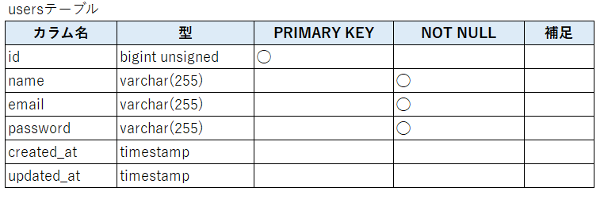
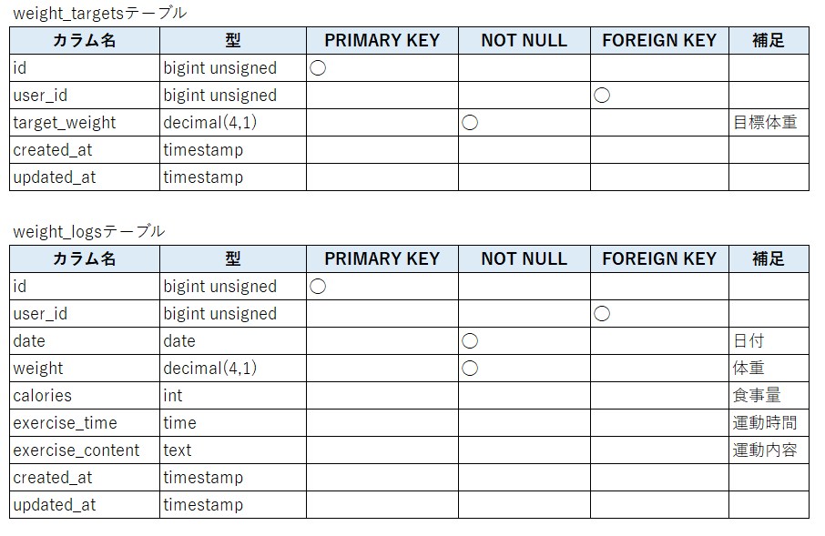
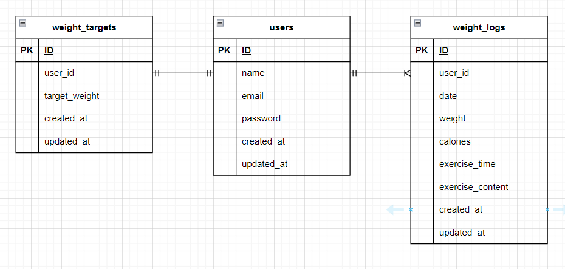

# PIGLY

## 環境構築
**Dockerビルド**
1. `git clone git@github.com:tommy311111/pigly.git`
2. DockerDesktopアプリを立ち上げる
3. `docker-compose up -d --build`

**Laravel環境構築**
1. `docker-compose exec php bash`
2. `composer install`
3. 「.env.example」ファイルを 「.env」ファイルに命名を変更。または、新しく.envファイルを作成
4. .envに以下の環境変数を追加
``` text
DB_CONNECTION=mysql
DB_HOST=mysql
DB_PORT=3306
DB_DATABASE=laravel_db
DB_USERNAME=laravel_user
DB_PASSWORD=laravel_pass
```
5. アプリケーションキーの作成
``` bash
php artisan key:generate
```

6. マイグレーションの実行
``` bash
php artisan migrate
```

7. シーディングの実行
``` bash
php artisan db:seed
```

## テストユーザー情報（初期データ）

開発環境またはテスト環境でログイン確認するためのテストユーザーがあらかじめ用意されています。

| 項目           | 内容               |
|----------------|--------------------|
| メールアドレス | `test@example.com` |
| パスワード     | `Password123!`     |

> セキュリティ上、本番環境には **このテストユーザーを残さないようにしてください**。


## 使用技術(実行環境)
- PHP7.4.9
- Laravel8.83.3
- MySQL8.0.26

## テーブル設計



## ER図


## 主な画面とルート一覧

| パス                     | 概要                   |
|--------------------------|------------------------|
| `/register/step1`        | 会員登録ステップ1      |
| `/register-step2`        | 会員登録ステップ2      |
| `/login`                 | ログイン               |
| `/weight_logs`           | 体重記録一覧（ログイン後） |
| `/weight_logs/create`    | 新規記録作成           |
| `/weight_logs/goal_setting` | 目標体重設定        |

## URL
- 開発環境：http://localhost
- phpMyAdmin:：http://localhost:8080/
